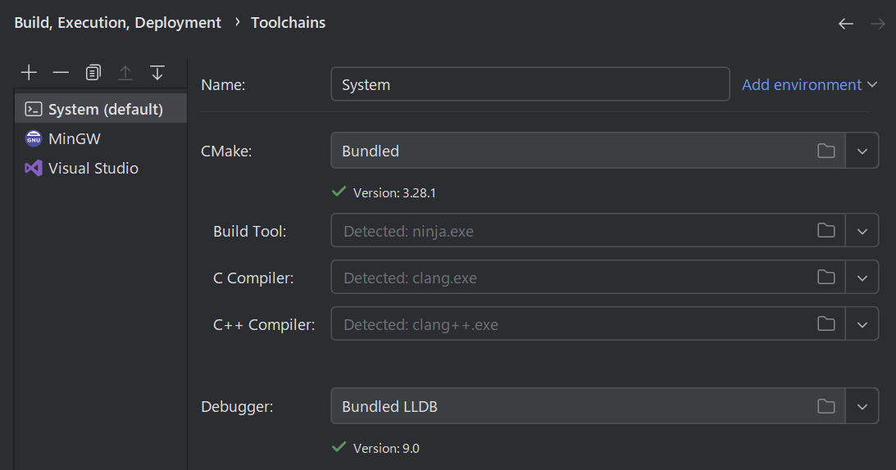

# Solid
`Solid` は DirectX12 で実装された描画エンジンと、それを使った技術デモ集です。


## セットアップ
リポジトリをクローンしてから一度だけ行う必要のある作業です。  
いくつかのライブラリを `vcpkg` から取得しており、それらはサブモジュールとしてぶら下がる構造になっています。
まずは `vcpkg` を初期化し、必要なライブラリをインストールしてください。

サブモジュールの初期化
````bat
git submodule update src\App\mod\vcpkg
````

ライブラリのインストール
````bat
cd src\App\mod\vcpkg
bootstrap-vcpkg.bat
vcpkg install directxtex
vcpkg install picojson
vcpkg install freetype
vcpkg install imgui[core,dx12-binding,win32-binding]:x64-windows
vcpkg install stduuid
vcpkg install openal-soft
````

ここから先のセットアップ手順は開発環境により異なります。

### VisualStudio Code
VisualStudio Code の場合、 `Solid.code-workspace` を開けばそのまま適切な設定が有効化されます。  
VisualStudio Code 向けの設定はリポジトリにコミットされているためです。  
（使っている人が多いだろうと見込んですぐセットアップできるようしてあります。）  
開いた時点で必要な拡張機能がインストールされていなかった場合、ワークスペース設定により必要な拡張機能がレコメンドされます。

コード補完が働かない場合、一度ビルドを実行してみてください。  
このリポジトリではCMakeがビルド時に生成する `compile_commands.json` を利用してコード補完を行います。

### VisualStudio
VisualStudio の場合、CMakeでソリューションとプロジェクトを生成する必要があります。
````
cd Solid
cmake -S src -B build -G "Visual Studio 17 2022"
````

#### Powershellの実行権限
ビルド時に一部のソースコードを生成するため、Powershellを使用しています。  
このためにビルドが失敗する場合、手動実行フラグをONにすることで自動生成をスキップできます。  
※自動生成されたコードもコミットされているので、ビルドして実行するだけなら常にスキップで問題ありません。  
cmakeでビルド構成を再生成する場合、事前に build フォルダ以下のファイルを削除する必要があります。
````bat
cmake -S src -B build -G "Visual Studio 17 2022" -DMANUAL_GENERATE=ON
````

### CLion
CLionは公式にCMakeをサポートしているので、基本的には公式の使い方に従えば開くことができます。

* リポジトリのルートディレクトリを開く
* ツールチェイン設定より `clang++`, `lldb` を使うように変更
    * 
* 実行時ディレクトリをリポジトリルートに変更
    * 
* [公式ドキュメント](https://pleiades.io/help/clion/reloading-project.html#manual-reload)を参考に `CMakeLists` を読み込む
* うまくいかなかったら `File>Invalidate Caches...` を実行して最初からやり直す

## ビルド

### VisualStudio Code
````bat
cd Solid
cmake -S src -B build -G "Ninja"
ninja -C build
````

#### Powershellの実行権限
ビルド時に一部のソースコードを生成するため、Powershellを使用しています。  
このためにビルドが失敗する場合、手動実行フラグをONにすることで自動生成をスキップできます。  
※自動生成されたコードもコミットされているので、ビルドして実行するだけなら常にスキップで問題ありません。  
cmakeでビルド構成を再生成する場合、事前に build フォルダ以下のファイルを削除する必要があります。
````bat
cd Solid
cmake -S src -B build -G "Ninja" -DMANUAL_GENERATE=ON
ninja -C build
````

#### OpenMPが見つからない場合
CMakeの問題と思われますが、OpenMPを発見できずにビルドに失敗することがあります。  
その場合は VisualStudio でビルドを試してみてください。

### VisualStudio
VisualStudioの場合、 `App` という名前になっているプロジェクトで実行ファイルをビルドできます。

### CLion
CLionの場合、 `App` という名前になっている構成で実行ファイルをビルドできます。

## テスト
アプリケーション本体、そして一部サブモジュールについてはテストが書かれています。
````bat
cd Solid
ninja -C build Math-Test
ninja -C build Graphics-Test
ninja -C build Utils-Test
````

全てのテストを実行するには、以下コマンドを実行します。  
ただしこれを実行するとアプリケーションのテストも実行されます。
````bat
ninja -C build Test
````

逆に、アプリケーションのテストだけを実行したい場合は以下を実行します。
````bat
ctest --test-dir build/App -R "^Test$" -V
````

## 注意点
デバッグ実行時には、assets以下にアセットが格納されている必要があります。  
一度は`./scripts`以下のインポートスクリプトを実行しておいてください。
````py
python scripts\audio_importer.py
python scripts\font_importer.py
python scripts\model_importer.py
python scripts\texture_importer.py
python scripts\vox_importer.py
````

build フォルダ以下に生成されるバイナリを実行するときは、  
Solid/assets を Solid/build/assets へコピーしてください。

## ライセンス
このリポジトリのソースコードはMITライセンスで公開されています。  
詳細は `license.txt` を確認してください。